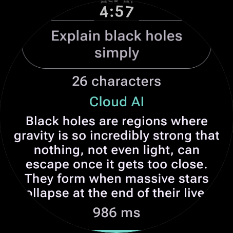
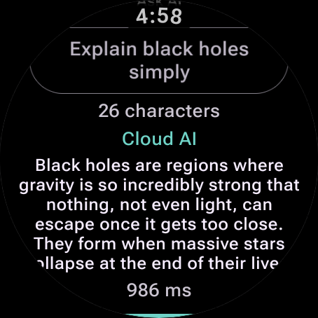
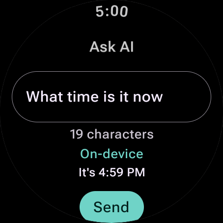
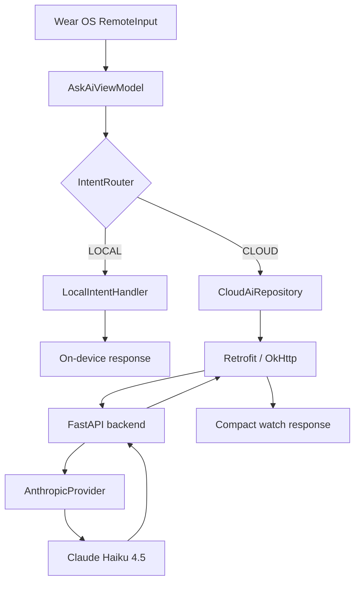

# Wearable AI Companion

A Wear OS AI assistant that keeps simple requests on-device and routes general
questions to Claude through a FastAPI backend. Built as a full-stack, offline-aware
mobile/wearable + backend project: Kotlin/Jetpack Compose on the watch, FastAPI +
the Anthropic Python SDK on the server.

## Screenshots

**1. Home / Connected** — backend health status and quick actions



**2. Voice → Cloud AI** — a voice-entered general question routed to Claude.
The latency shown is a single observed request, not a benchmark.



**3. Offline → On-device** — the Time quick action answering locally with the backend offline



## Demo Flow

The app classifies every request into one of two paths before it does anything else.

**LOCAL** — deterministic, on-device, works with the backend fully offline:

```
Wear OS input (RemoteInput)
  -> AskAiViewModel
  -> IntentRouter
  -> LocalIntentHandler
  -> on-device response
```

**CLOUD** — general questions, requires the backend:

```
Wear OS input (RemoteInput)
  -> AskAiViewModel
  -> IntentRouter
  -> CloudAiRepository
  -> Retrofit / OkHttp
  -> FastAPI
  -> AnthropicProvider
  -> Claude (Haiku 4.5)
  -> compact watch-sized response
```



## Features

- Native Wear OS text entry: system keyboard and voice input via `RemoteInput`
- Local-vs-cloud intent routing, decided per request before any network call
- "Time" and "Date" quick actions answer entirely on-device, no backend required
- "Explain" quick action and free-text questions route to Claude through the backend
- Home screen connectivity status: Checking / Connected / Offline, backed by a real `GET /health` check
- Short, watch-formatted Claude responses (plain text, no markdown, 1-2 sentences by default)
- Loading and error states on the Ask AI screen, with duplicate-send protection
- Latency shown for cloud responses
- Native Wear OS swipe-to-dismiss navigation

## Why Local vs Cloud Routing

Routing simple, deterministic requests on-device instead of always calling the cloud:

- Lower latency — "what time is it" doesn't need a round trip
- No unnecessary network dependency for things the watch already knows
- Lower API cost — trivial requests never touch a paid model
- More resilient — local intents keep working even if the backend is down
- The router is intentionally conservative: it matches a fixed set of exact,
  normalized phrases rather than doing substring matching, so a question like
  *"What is time complexity?"* correctly falls through to Claude instead of
  being misrouted just because it contains the word "time"

## Tech Stack

**Android**
- Kotlin
- Jetpack Compose for Wear OS
- Wear Compose Material3
- ViewModel / StateFlow
- Retrofit
- OkHttp

**Backend**
- Python
- FastAPI
- Anthropic Python SDK
- Pydantic
- pytest

**Testing**
- JUnit
- kotlinx-coroutines-test
- Fake repositories / providers (no mocking framework)
- FastAPI `TestClient` / pytest

## Project Structure

```
app/src/main/java/.../
  data/                # Retrofit API service, models, CloudAiRepository, HealthChecker
  domain/routing/       # IntentRoute, IntentRouter, LocalIntentClassifier, LocalIntentHandler
  presentation/
    ask/                # Ask AI screen, ViewModel, UI state
    home/                # Home screen, ViewModel, quick actions, connectivity state
    navigation/          # Wear SwipeDismissableNavHost + route definitions
    components/          # Shared Wear Compose UI pieces
    theme/                # Colors and MaterialTheme

backend/
  app/
    main.py             # FastAPI app, /health and /chat endpoints
    providers.py         # AIProvider abstraction: MockProvider, AnthropicProvider
  tests/                 # pytest suite (dependency-overridden, no real API calls)
```

`domain/routing` has no Android or network dependencies — it's plain Kotlin,
which is what makes local intent handling testable and truly backend-independent.
`data/` isolates all networking behind interfaces (`CloudAiRepository`,
`HealthChecker`) so the ViewModels never depend on Retrofit directly.

## API

### `GET /health`

```json
{
  "status": "ok"
}
```

### `POST /chat`

Request:

```json
{
  "message": "Explain black holes simply"
}
```

Response:

```json
{
  "response": "...",
  "request_id": "...",
  "latency_ms": 986.0
}
```

`latency_ms` is the backend's own request-processing time (server receive to
server respond, including the Claude API call) — it's diagnostic information
returned by the API, not a benchmark or a guarantee of end-to-end latency as
seen from the watch. `request_id` exists for backend-side tracing/log
correlation; it is not currently shown in the Wear OS UI.

## Running Locally

### Backend

From the repository root:

```bash
cd backend
python3 -m venv .venv
source .venv/bin/activate
pip install -r requirements.txt
```

Load your Anthropic API key into the shell without putting it in source code:

```bash
read -s "ANTHROPIC_API_KEY?Anthropic API key: "
export ANTHROPIC_API_KEY
echo
```

Then start the server:

```bash
uvicorn app.main:app --host 0.0.0.0 --port 8000
```

`backend/.env` is gitignored, and `backend/.env.example` documents the one
expected variable name (`ANTHROPIC_API_KEY`). Never commit a real key.

### Android / Wear OS

1. Open the project root in Android Studio.
2. Create or select a Wear OS emulator (this project was built and verified against Wear OS 6 / API 36).
3. With the backend running locally, the app reaches it at `http://10.0.2.2:8000` — the special alias the Android emulator uses to reach the host machine's loopback interface. No configuration is needed for emulator development.
4. Run the app normally from Android Studio (Run ▶ on the Wear OS device/emulator target).

**Emulator voice input note:** microphone input on the emulator depends on
host audio being routed in, which sometimes needs to be enabled explicitly:

```bash
adb -s <emulator-id> emu avd hostmicon
adb -s <emulator-id> shell cmd sensor_privacy disable 0 microphone
```

These are emulator/host configuration steps, not app behavior — a physical
watch's own microphone does not need this. If speech recognition becomes
unreliable after changing these settings, a cold boot of the emulator
resolves it in most cases.

## Testing

**Android:**

```bash
./gradlew testDebugUnitTest
```

61 JVM unit tests currently pass.

**Backend:**

```bash
cd backend
source .venv/bin/activate
pytest
```

8 backend tests currently pass. Backend tests use `MockProvider` via FastAPI
dependency overrides and never call the real Anthropic API.

Coverage includes: local-vs-cloud routing decisions, false-positive routing
traps (e.g. "time" appearing in an unrelated question), deterministic
time/date responses via injected `Clock`, cloud repository error mapping
(timeout / connection / HTTP / malformed response), duplicate-send
protection, the health checker, Home connectivity states, quick-action
behavior, provider failures mapping to HTTP 503, and provider tests that
never touch a real API key or network.

## Error Handling / Reliability

- Network failures are classified at the repository boundary: connection,
  timeout, HTTP 5xx, and malformed responses each map to a distinct,
  user-readable message
- No raw exceptions, stack traces, or exception class names ever reach the
  Wear OS UI
- Backend-side provider failures (timeout, connection, Anthropic API errors)
  all collapse to a stable `HTTP 503` with a fixed `"ai_provider_unavailable"`
  detail — internal failure category is logged server-side only
- `POST /chat` is never automatically retried: an ambiguous failed request
  may have already reached the paid provider, so retrying could duplicate
  billed work
- Coroutine cancellation propagates normally and is never swallowed as a
  failure result

## Security / Development Notes

- The Anthropic API key lives only on the backend, read from
  `ANTHROPIC_API_KEY` in the environment — it is never embedded in the
  Android app or sent to the client
- Cleartext HTTP is allowed only for `10.0.2.2`, scoped via Android's
  network security config, specifically for local emulator development
- A real deployment would need to run the backend behind HTTPS; this project
  does not include that setup
- The backend currently runs locally on the developer's machine — it is not
  deployed anywhere public

## Known Limitations

- Verified on a Wear OS 6 / API 36 emulator; not yet validated on a physical Wear OS watch
- The backend runs locally and is not production-deployed
- No conversation history — each request is independent
- No database or persistence layer
- No authentication on the backend API
- Voice recognition quality depends on Wear OS's speech services and, on
  emulator, host audio/microphone configuration

## Design Decisions

- **Native `RemoteInput` instead of a custom speech-recording UI** — Wear OS
  has no on-screen keyboard by design; using the system's own
  keyboard/voice/handwriting picker is the idiomatic pattern and avoids
  reimplementing speech capture
- **Conservative, exact-match local router** — trades a bit of recall for
  correctness; a broader substring matcher would misroute genuine questions
  that happen to contain words like "time" or "date"
- **The Anthropic secret never leaves the backend** — the Android app only
  ever talks to the local FastAPI service, never to Anthropic directly
- **Repository and provider abstractions on both sides** (`CloudAiRepository`,
  `HealthChecker`, `AIProvider`) — every network dependency is an interface,
  which is what makes the ViewModel and endpoint tests possible without a
  real network or a real API key
- **No automatic retry on `POST /chat`** — a failed request may have already
  reached Claude; retrying blindly risks duplicating paid work
- **A short, format-constrained system prompt** — Claude is instructed to
  answer in 1-2 sentences, plain text, no markdown, so responses fit a small
  round display without heavy scrolling
